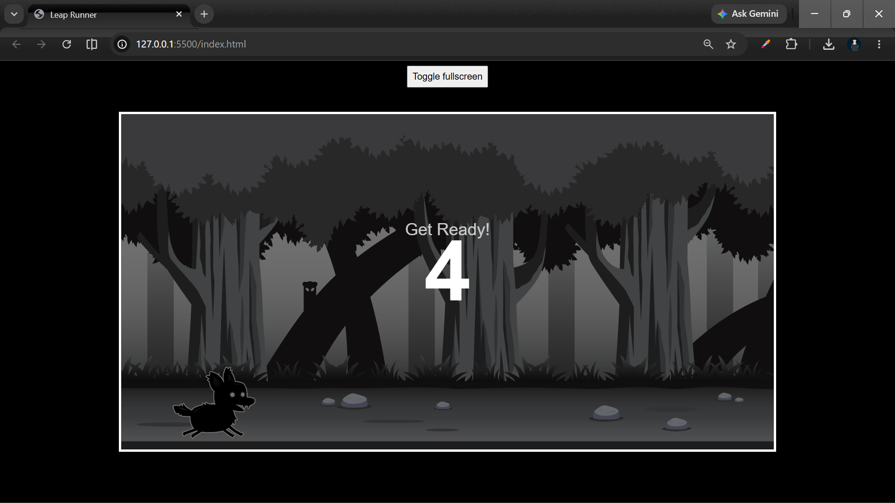

# Leap Runner

<div align="center>
   
</div>

A fast-paced 2D side-scrolling endless runner built with pure HTML5 Canvas and vanilla JavaScript.

Dodge enemies, jump over obstacles, and see how high you can score!

## How to Play

### Desktop

- **← / →** : Move left / right
- **↑** : Jump
- **Enter** : Restart after Game Over
- Click **Toggle fullscreen** for immersive play

### Mobile

- **Swipe up** : Jump
- **Swipe down** : Restart after Game Over
- **Landscape mode only** – the game will ask you to rotate your phone if you are in portrait orientation

## Features

- Smooth sprite-sheet animation for player and enemies
- Collision detection
- Score tracking
- Touch controls for mobile
- Fullscreen support
- Portrait-mode lock with animated “Please rotate your phone” overlay
- Responsive canvas that scales to the screen
- 5-second countdown before the game starts

## Getting Started

1. Clone the repository:

   ```bash
   git clone https://github.com/yourusername/leap-runner.git
   cd leap-runner
   ```

2. Open `index.html` in a modern browser  
   _(or serve it with any static file server)_

   ```bash
   # Example with Python
   python -m http.server 8000
   ```

3. Play!

## Project Structure

```
leap-runner/
├── index.html          # Main HTML
├── style.css           # Styles + rotate overlay
├── script.js           # Game logic
├── player.png          # Player sprite sheet
├── enemy_1.png         # Enemy sprite sheet
├── background_single.png
└── README.md
```

## Browser Support

Works best in modern browsers that support:

- HTML5 Canvas
- ES6+
- Fullscreen API
- Touch events / Orientation media queries

## Credits

Built with vanilla JavaScript.  
Sprite assets included in the project.

---

Enjoy the run! 🏃‍♂️
